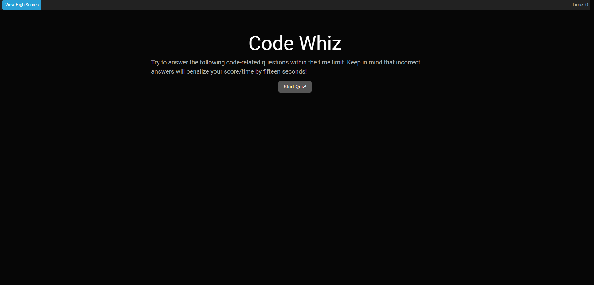

# Code-Whiz
## Description

I wanted to have a fun little test of coding knowledge by making a short quiz game, with the option to get competetive with high scores and time-based stakes. This was a really
neat little project that ended up looking pretty nice. I wanted the user to have time deducted for making incorrect answers and the score to be based off how quickly you answered
the questions correctly. This project taught me a lot about using js to manipulate css and html in many different ways, and has kind of made me more comfortable with the idea of
applying my existing code knowledge to front-end development. It helps me remember some of the basics as well as track my progress getting better.

## Table of Contents

- [Usage](#usage)
- [Credits](#credits)
- [License](#license)
- [Features](#features)

## Usage

Head on over here to check out the page ==> [Code Whiz](https://ikonicres.github.io/Code-Whiz/)    
The page is easy to use: When the "View High Scores" button is clicked, it will navigate the user to the high score page. When "Start Quiz" is pressed, the timer will start and progress bar will start counting down and all questions and answers will populate.

  
The time is displayed on the top right and a progress bar appears giving you better visualization on time left.

  
If the answer is chosen correctly, the program highlights the answer in green and displays "Correct!", otherwise it highlights the incorrect answer in red as well and displays "Wrong!" instead.  

  
As stated in the text above the button the quiz is timed, the time left becomes your score, and incorrect answers will subtract fifteen seconds from your time! 
If you run out of time, the final score will be set to zero as that's how much time is left. The user can enter a name to be saved to localstorage, or if left empty the name will read the default value of "FunkyAnon".  
  
The score page has a "Play" button to replay the quiz, and a "Clear" button to clear the list of high scores from localstorage  
  

## Credits

Much thanks to TAs, classmates, and cold brew once again.

## License

The MIT License (MIT)

Copyright (c) 2023 Michael Ikonomou

Permission is hereby granted, free of charge, to any person obtaining a copy of this software and associated documentation files (the "Software"), to deal in the Software without restriction, including without limitation the rights to use, copy, modify, merge, publish, distribute, sublicense, and/or sell copies of the Software, and to permit persons to whom the Software is furnished to do so, subject to the following conditions:

The above copyright notice and this permission notice shall be included in all copies or substantial portions of the Software.

THE SOFTWARE IS PROVIDED "AS IS", WITHOUT WARRANTY OF ANY KIND, EXPRESS OR IMPLIED, INCLUDING BUT NOT LIMITED TO THE WARRANTIES OF MERCHANTABILITY, FITNESS FOR A PARTICULAR PURPOSE AND NONINFRINGEMENT. IN NO EVENT SHALL THE AUTHORS OR COPYRIGHT HOLDERS BE LIABLE FOR ANY CLAIM, DAMAGES OR OTHER LIABILITY, WHETHER IN AN ACTION OF CONTRACT, TORT OR OTHERWISE, ARISING FROM, OUT OF OR IN CONNECTION WITH THE SOFTWARE OR THE USE OR OTHER DEALINGS IN THE SOFTWARE.

## Features

-Progress bar to check time left, animated and nicely themed. 
-Saving score to local storage in "High scores"
-Clearing high scores from local storage
-Multiple pages to navigate
-Visual indicators to tell whether you got a question right or not, as well as correct answer indication if answered incorrectly
-Fully commented/cleaned and written in jQuery/bootstrap making it easy to read and modify
